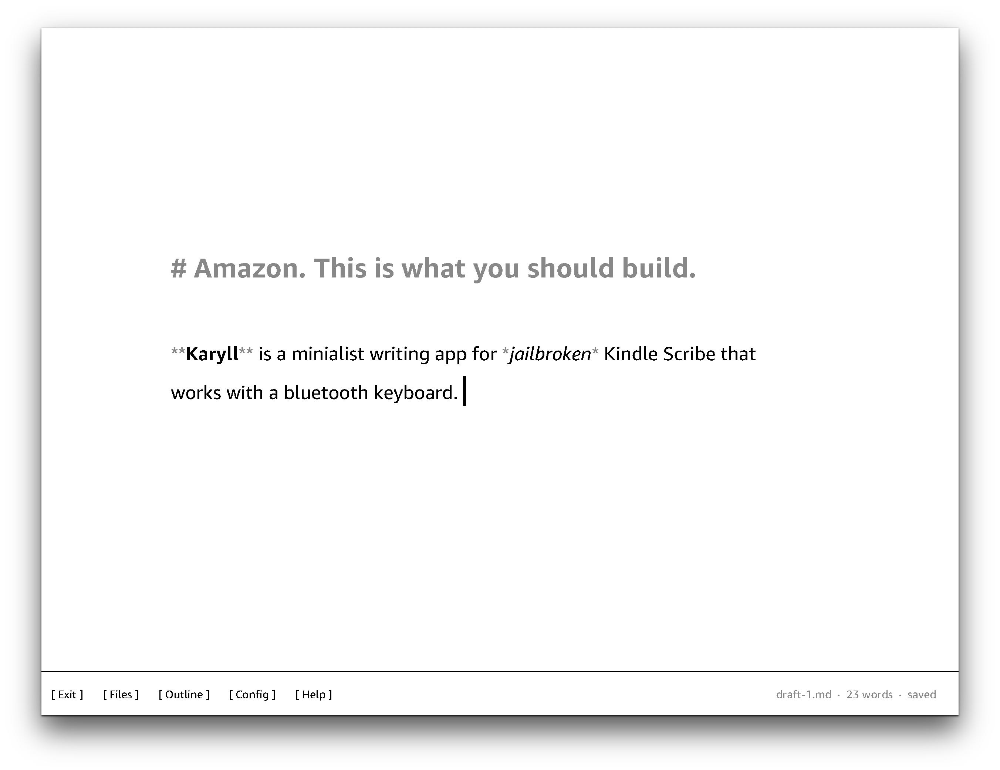
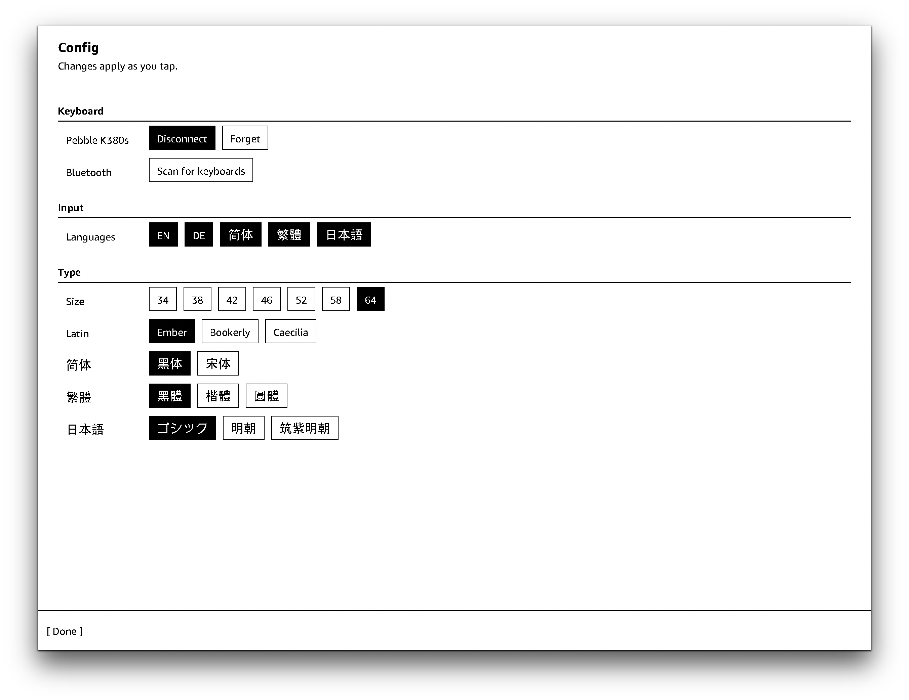
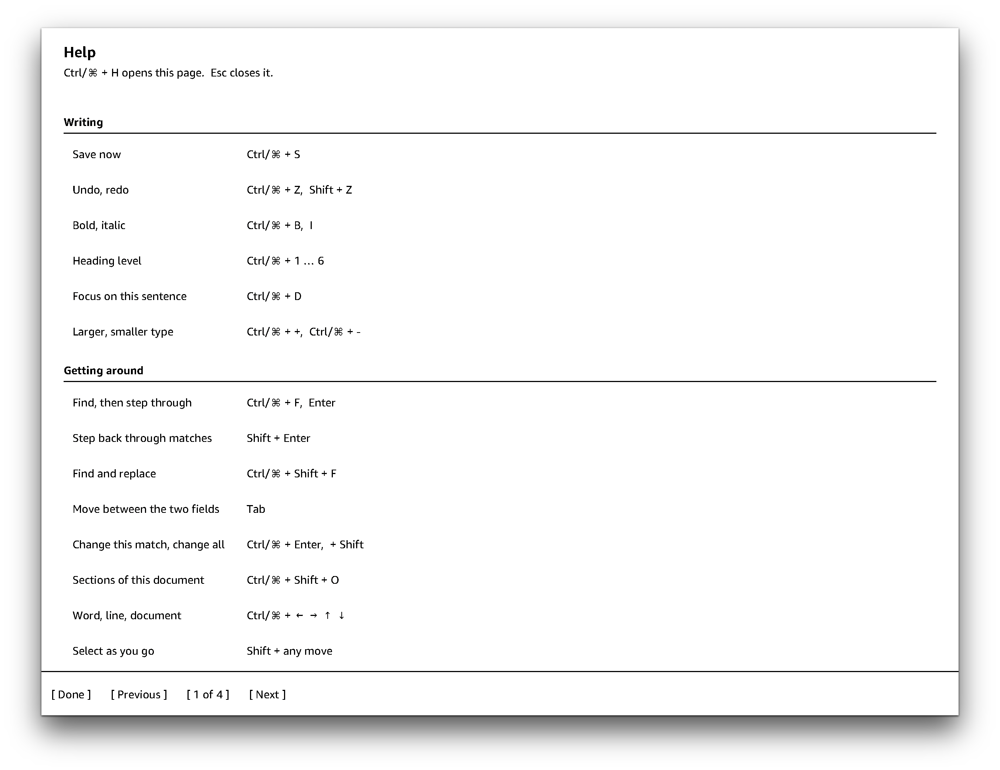
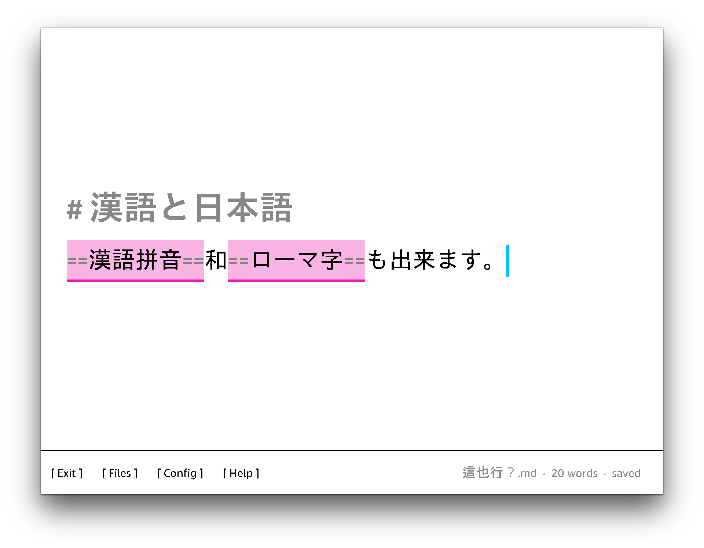
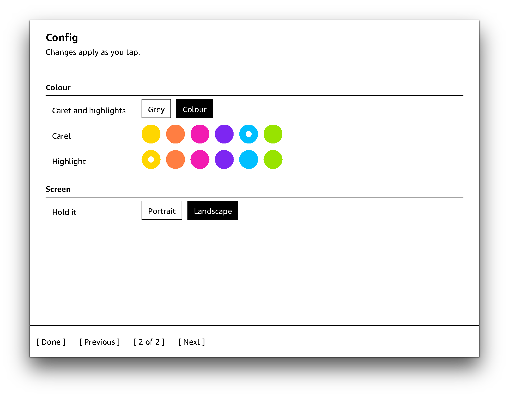

# Karyll

Karyll is a minimalistic writing app with bluetooth keyboard for jailbroken Kindles.

Tested on Kindle Scribe (2022; firmware 5.19.4.0.1), Kindle Colorsoft (firmware 5.18.0.2) and Kindle Oasis 2 (firmware 5.16.2.1.1), with a Pebble K380s keyboard.

## Build

```sh
git clone https://github.com/huangziwei/karyll && cd karyll/
./build.sh
```

## Install

Download and unzip the latest `karyll-v<x.y.z>-kindle.zip` file from the [release page](https://github.com/huangziwei/karyll/releases), then copy some files to your device: 

| from | to | notes |
|:--|:--|:-- |
| `extensions/karyll/` | `/mnt/us/extensions/karyll/` | or anywhere you store your extensions |
| `documents/karyll.sh` | `/mnt/us/documents/karyll.sh` | or anywhere you store your scriptlets |


## Gallery

### Kindle Scribe

<table>
  <tr>
    <td width="50%" align="center">
      <br />
      <sub>Editor</sub>
    </td>
    <td width="50%" align="center">
      <br />
      <sub>Files</sub>
    </td>
  </tr>
  <tr>
    <td width="50%" align="center">
      <br />
      <sub>Config</sub>
    </td>
    <td width="50%" align="center">
      <br />
      <sub>Help</sub>
    </td>
  </tr>
</table>

v0.1.0 started with the Kindle Scribe. When I bought it, I was hoping Amazon would add keyboard support and a writing app soon, but three years have passed and it still hasn't happened. Look at ReMarkable, writing on an e-ink device is the whole selling point. The 2022 Scribe actually has everything needed to offer such a writing experience: the Bluetooth is always on, so it can connect to a keyboard within seconds; it has a bigger screen, so it can display a lot of text compared to a smaller screen; the accelerometer can detect 90° rotation, so you can place the screen in any direction; and it has a faster processor, so typing won't feel laggy at all. Amazon should build this app, yet it seems to be intentionally avoiding this market. What a shame.

### Kindle Colorsoft 

<table>
  <tr>
    <td width="50%" align="center">
      <br />
      <sub>Editor</sub>
    </td>
    <td width="50%" align="center">
      <br />
      <sub>Config</sub>
    </td>
  </tr>
</table>

v0.2.0 added support for smaller devices. I did it for fun, mostly because I was curious about the hardware specs of the Oasis 2 and the Colorsoft, and I learned more about them than I had before. But I probably won't actually write with them. Other than its somewhat dull colors, the writing experience on the Colorsoft is actually quite poor, primarily due to performance. The Bluetooth is fine, but the device could use a better processor or more RAM. In Gray mode, the performance is acceptable, but that defeats the purpose of using a color screen; in Color mode, it becomes quite laggy, and colors flicker as the caret moves. It has no accelerometer, so I had to add a config option to allow screen rotation between portrait and landscape. I guess the only new thing about the colorsoft is its screen, at the core, it's still just the same old Paperwhite.

### Kindle Oasis 2

The Oasis doesn't deserve a screenshot. It will be just same grayscale images, but on a smaller screen, and we already have grayscale images on a bigger screen, and also some on a color smaller screen. All I want to say is, the Oasis is a terrible device to write with. The Bluetooth takes about 20 seconds to connect to the keyboard, and it's quite slow to respond to keystrokes. It does have an accelerometer and can rotate on all four sides like the Scribe, but that's about all one can say in its favor. But what would you expect from a 9-year-old reading device?


## Thanks

This project will not be possible without [kindle-hid-passthrough](https://github.com/zampierilucas/kindle-hid-passthrough).