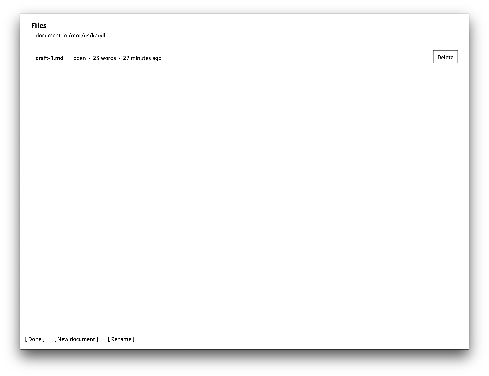

# Karyll

Karyll is a minimalistic writing app with bluetooth keyboard for jailbroken Kindle Scribe.

Tested on Kindle Scribe (2022; firmware 5.19.4.0.1).

## Build

```sh
git clone https://github.com/huangziwei/karyll && cd karyll/
./build.sh
```

## Install

Copy both of these into `/mnt/us/` over MTP:

    extensions/karyll    # the app
    documents/Karyll.sh  # the scriptlet home-screen tile


## Screenshots

<p align="center">
    
    
    
    
</p>

## Thanks

This project will not be possible without [kindle-hid-passthrough](https://github.com/zampierilucas/kindle-hid-passthrough).